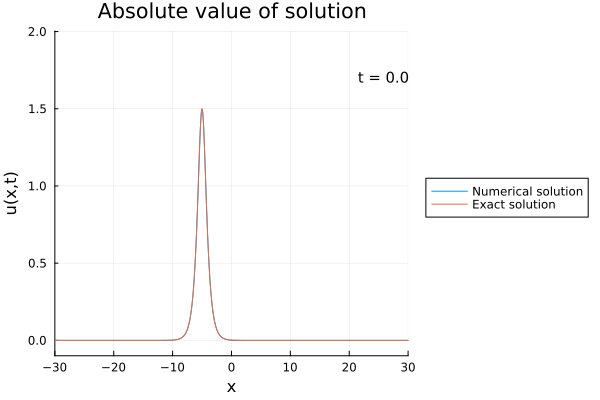
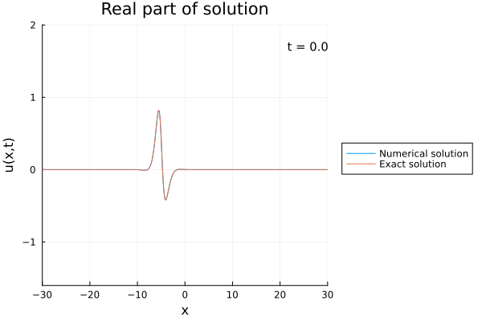
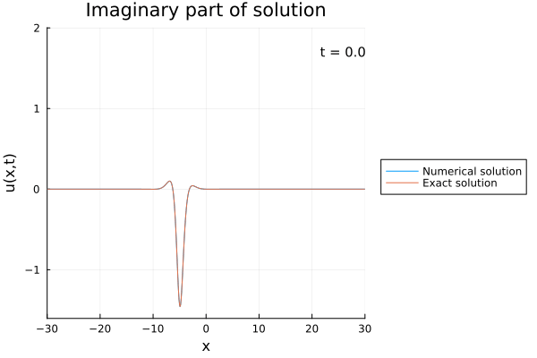

# Dokumentation Numerikpraktikum
In diesem Julia-Programm wird das in [1] beschriebene Finite-Differenzen Schema implementiert
und mit einem expliziten Schema verglichen.

Die Nichtlinear Schrödingergleichung (NLS) ist eine partielle Differentialgleichung
deren Lösung $u(x,t): \mathbb{R} \times \mathbb{R} \to \mathbb{C}$ die Gleichung 
```math
i u_t - u_{xx} + \lambda |u|^2 u = 0 \\
u(x,0) = \phi(x)
```
erfüllt. Dabei ist $i = \sqrt{-1}$ und die Ableitungen sind als Index geschrieben. Dabei
ist $\lambda$ ein reeler Parameter und $\phi: \mathbb{R} \to \mathbb{R}$ eine gegebene Funktion.

## Mathematischer Hintergrund
Lösungen der NLS erhalten dabei die zwei Größen:
```math
\int_{\mathbb{R}} |u|^2 \; dx = const,\\
\int_{\mathbb{R}} \left(\frac{1}{2}|u_{x}|^2 + \frac{\lambda}{4}|u|^4\right)\; dx = const.
```
In [1] wird ein Finites Differenzenschema angegeben, dass diese beiden Größen erhält und
welches implementiert wird. Allerdings wird in diesem Paper nicht die Konvergenz des
Schemas gezeigt und numerisch kann dies auch nicht beobachtet werden. Allerdings erhält
es die beiden oben genannten Größen.

Eine Lösung zum Testen ist gegeben mit
```math
u(x,t) = \frac{3}{2}\exp\left(i(2x - \frac{7}{4}t)\right) sech\left(\frac{3}{2}(x+5) - 6t\right).
```

Das Schema in [1] wird verglichen mit dem expliziten Schema
```math
\frac{i}{\Delta t}(U^{k+1} - U^{k}) - \frac{1}{|\Delta x|^2}AU^k + F_k(U^k) = 0
```
mit $A$ als Finite-Differenzen Matrix für die zweite Ableitung und $U^k$ als Approximation
im $k$-ten Zeitschritt. Die Funktion $F$ ist gegeben durch
```math
(F_k(U)))_j = \frac{\lambda}{4}(|U_j|^2 + |U_j^k|^2)(U_j + U_j^k)
```
mit $j$ als Index für den Vektor.
## Code Dokumentation

```@autodocs
Modules = [NLS]
```
Der Code kann ausgeführt werden, indem die Datei `NLS.jl` im Ordner `src` ausgeführt wird.
## Ergebnisse
Das Finite Differenzen Schema aus [1] erhält die beiden oben genannten Größen, während das
explizite Finite Differenzen Schema diese nicht erhält. Weiterhin konnte beobachtet werden,
dass das explizite Verfahren sehr instabil ist und nur für sehr kleine Gittweiten und noch
kleinere Zeitschritte plausible Werte liefert. Das explizite Verfahren erhält auch keine der
beiden Erhaltungsgrößen.

Auch kann mit numerischen Experimenten nur eine Konvergenz der Differenz der Normen
beobachtet werden, während Norm der Differenz recht hoch ist und das Verfahren gegen
eine andere Lösung konvergiert als die Testlösung. Im Paper [1] wird die Konvergenz
behauptet, aber nicht bewiesen.
## Visualisierung




## Transparenz-Hinweis KI
Der Code für die NLS-Gleichung wurde ohne Zurhilfenahme von KI erstellt. Die Dokumentation
des Codes und das Bash-Skript zur Ausführung wurden mit Hilfe von ChatGPT erstellt und
menschlich nochmal geprüft.
## Referenzen
[1] M. Delfour, M. Fortin, G. Payre: Finite Difference Solutions of a Non-linear Schrödinger equation. Journal of Computational Physics 44, 277-288 (1981)
[Journal](https://www.sciencedirect.com/science/article/abs/pii/0021999181900528)
